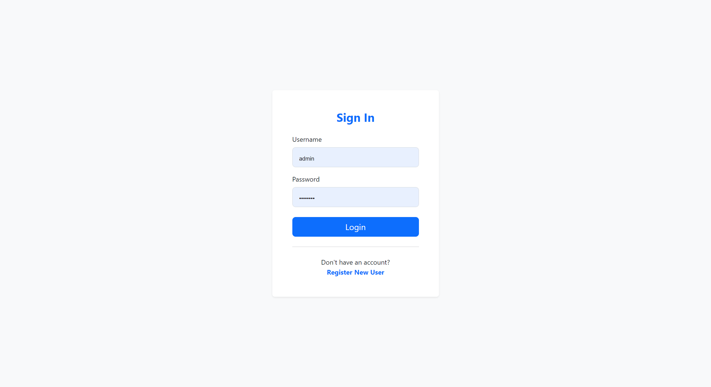
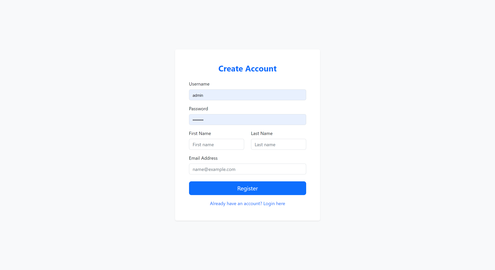
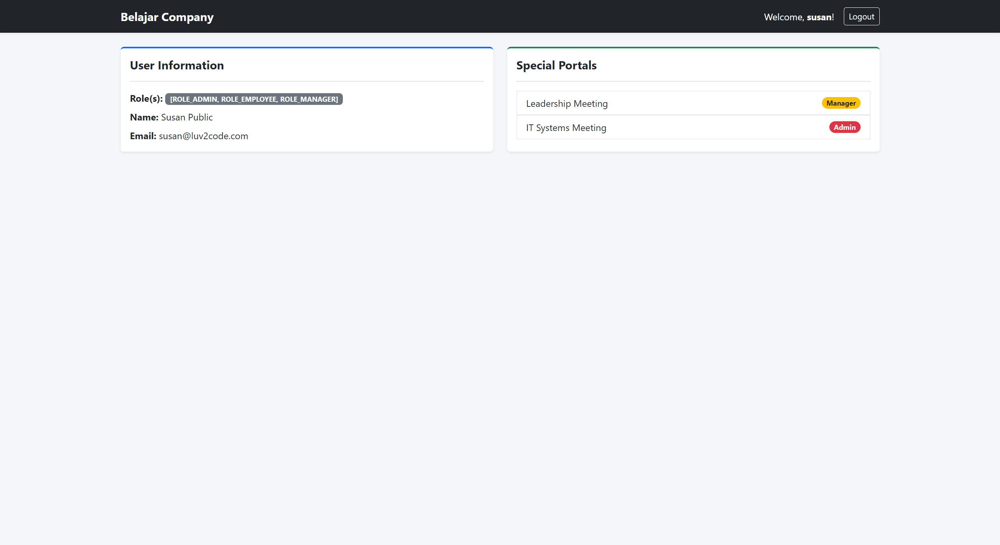

# Spring Boot MVC Security - User Management System 🛡️

A modern, role-based user authentication and registration system built with Spring Boot, Spring Security, and Thymeleaf. This project serves as a practical implementation of Spring MVC Security, featuring a clean and responsive user interface using Bootstrap 5.

## 🚀 About The Project

This application demonstrates how to implement robust security in a Spring Boot web application. It handles user registration, secure login/logout processes, and role-based access control (RBAC) to restrict access to specific areas of the application based on user roles (e.g., ADMIN, MANAGER, EMPLOYEE).

### ✨ Key Features
* **Spring Security Integration:** Comprehensive security configuration for HTTP requests.
* **Role-Based Access Control (RBAC):** Distinct dashboards and access levels for `MANAGER` and `ADMIN` roles.
* **BCrypt Password Hashing:** Secure password storage using the BCrypt hashing algorithm.
* **Custom Login & Registration:** Tailored forms for user authentication and creation.
* **Modern UI/UX:** Responsive and clean frontend design utilizing Bootstrap 5.

## 📸 Project Showcase

### 🏠 Landing Page


### 🔐 Authentication
<p align="center">
  
  
</p>

### 📊 Dashboard & Role Access


<p align="center">
  
  
</p>

## 🛠️ Built With

* **Backend:** Java, Spring Boot, Spring MVC, Spring Security
* **Frontend:** HTML5, Thymeleaf, Bootstrap 5
* **Database:** MySQL
* **Security:** BCryptPasswordEncoder

## ⚙️ Getting Started

To get a local copy up and running, follow these simple steps.

### Prerequisites
* Java Development Kit (JDK) 11 or higher
* Maven
* MySQL Server installed and running

### Database Setup 🗄️
**Important:** The SQL script required to create the database schema and initial roles is included within the project files. 

1. Locate the SQL script inside the project directory `/sql-scripts/`
2. Execute the script in your MySQL environment to set up the database structure before running the application.
3. Update the `application.properties` file with your MySQL credentials:
   
   ```properties
   spring.datasource.url=jdbc:mysql://localhost:3306/your_database_name
   spring.datasource.username=your_username
   spring.datasource.password=your_password

#### Installation
Clone the repository:

```Bash
git clone [https://github.com/username/your-repo-name.git](https://github.com/username/your-repo-name.git)
```
Navigate to the project directory and build the project using Maven:

```Bash
mvn clean install
```
Run the Spring Boot application:

```Bash
mvn spring-boot:run
```
Open your browser and navigate to http://localhost:8080

### 👨‍💻 Penulis
Raju Putra Dermawan Software Engineer | Backend Developer

💼 LinkedIn: [linkedin.com/in/raju-putra-dermawan](https://www.linkedin.com/in/raju-putra-dermawan-244919220/)
